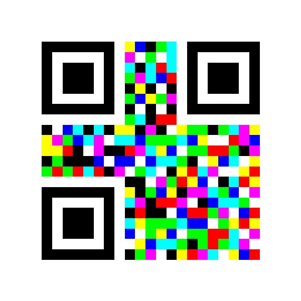

# jsQRGB

## Introduction

jsQRGB is a javascript package for generating and recognizing QRGB codes. 

QRGB code is an extension of the traditional QR code. It distributes data across three color channels (Red, Green, and Blue) to achieve the goal of storing more information within the same number of pixels compared to a standard QR code.

A demo of QRGB code:



## Installation

Install using npm:

```bash
npm install jsqrgb
```

# Usage

```javascript
import jsQRGB from "jsqrgb";

// Recognize QRGB code
const canvas = document.createElement('canvas')
const ctx = canvas.getContext('2d')!;
const imgData = ctx.getImageData(0, 0, frame.displayWidth, frame.displayHeight)
const data = jsQRGB.recognize(imgData);

// Generate QRGB code
const data = 'Hello World';
const qrgbImageData = jsQRGB.generate(textEncoder.encode(data), {
    size: canvasSize,
});
```